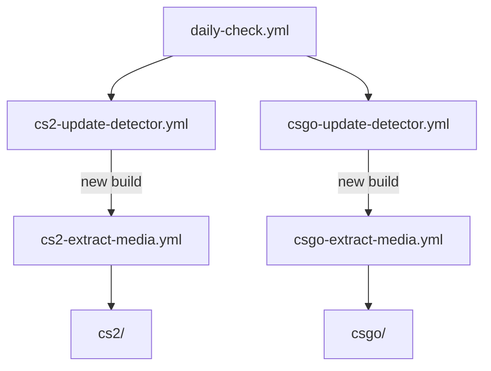

# Counter-Strike Icons

A collection of icons and media assets automatically extracted from **Counter-Strike 2** and **Counter-Strike: Global Offensive**.

## 📖 About

This repository serves as an up-to-date archive of icons and media files from Valve Counter-Strike builds. The automation watches for updates to both CS2 and CS:GO, extracts vector assets from the game depots, and commits the results back to this repository.

Current asset output locations:

- `cs2/` for Counter-Strike 2 assets
- `csgo/` for Counter-Strike: Global Offensive assets

## ⚙️ How It Works

The project relies on reusable GitHub Actions workflows with a single scheduled entry point.

| Workflow | Purpose | Trigger | Output |
|---|---|---|---|
| `.github/workflows/daily-check.yml` | Central scheduler that launches both detector pipelines. | `schedule`, `workflow_dispatch` | Calls both detector workflows via `workflow_call`. |
| `.github/workflows/cs2-update-detector.yml` | Checks app `730` for a new public build ID and updates `cs2_version.txt`. | `workflow_call`, `workflow_dispatch` | Calls the CS2 extraction workflow when the build changes. |
| `.github/workflows/cs2-extract-media.yml` | Downloads the required CS2 VPK data, extracts `.vsvg_c` assets, and converts them to `.svg`. | `workflow_call`, `workflow_dispatch` | Publishes extracted assets into `cs2/` and uploads an artifact. |
| `.github/workflows/csgo-update-detector.yml` | Checks app `4465480` for a new public build ID and updates `csgo_version.txt`. | `workflow_call`, `workflow_dispatch` | Calls the CS:GO extraction workflow when the build changes. |
| `.github/workflows/csgo-extract-media.yml` | Downloads the required CS:GO VPK data from depot `731` and extracts plain `.svg` assets. | `workflow_call`, `workflow_dispatch` | Publishes extracted assets into `csgo/` and uploads an artifact. |

## 🔐 Required Secrets

The extraction workflows require these repository secrets:

- `STEAM_USERNAME`
- `STEAM_PASSWORD`

These credentials are passed from the scheduler to the detector workflows, and from the detector workflows to the extraction workflows via `workflow_call`.

## 📄 License

All Counter-Strike assets are the property of **Valve Corporation**. This repository is intended for community and educational use only.

## 🤝 Contributing

Since this repository is automatically maintained via CI/CD workflows, manual contributions to the asset files are usually unnecessary. If you want to improve the extraction workflows, scheduling, or repository structure, open an issue or pull request.